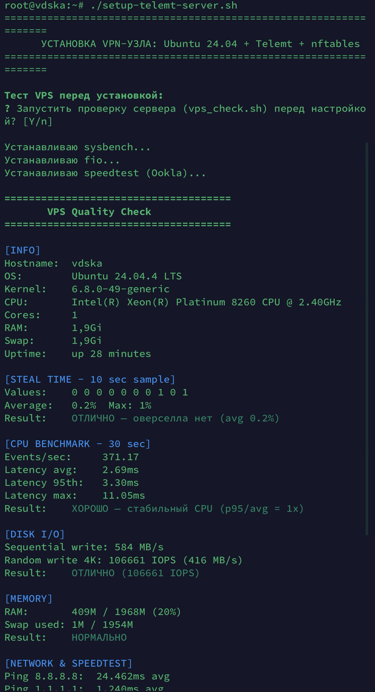
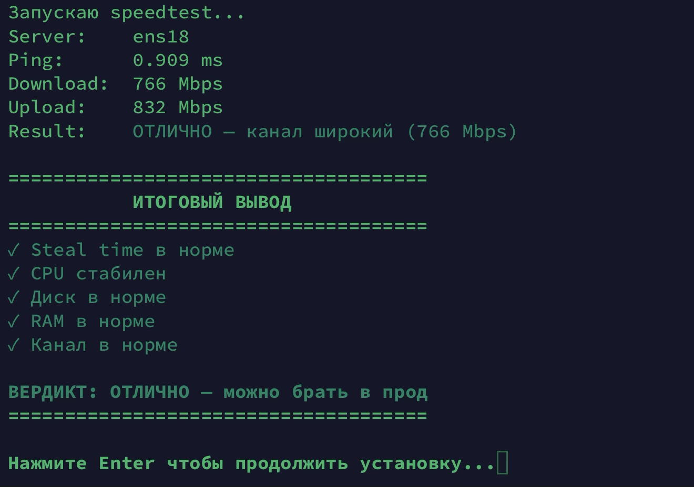
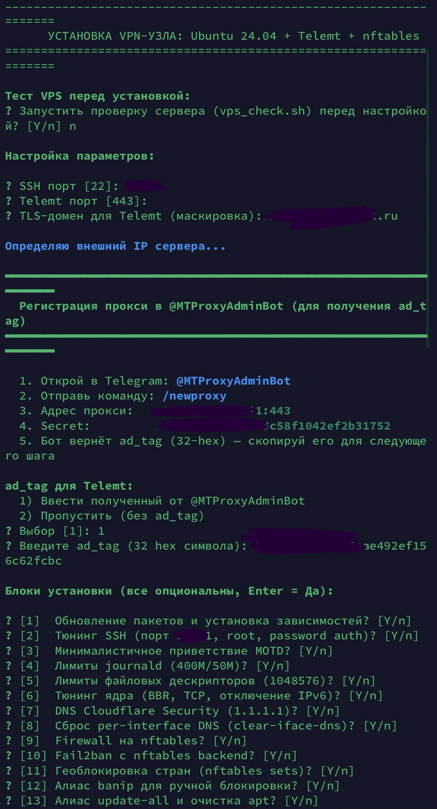
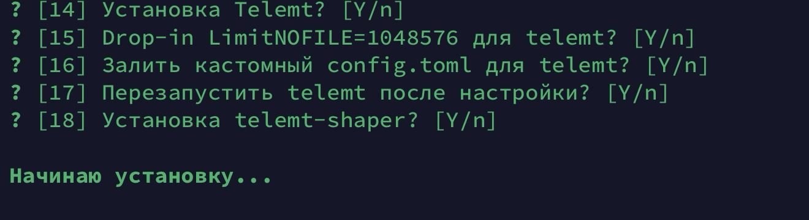
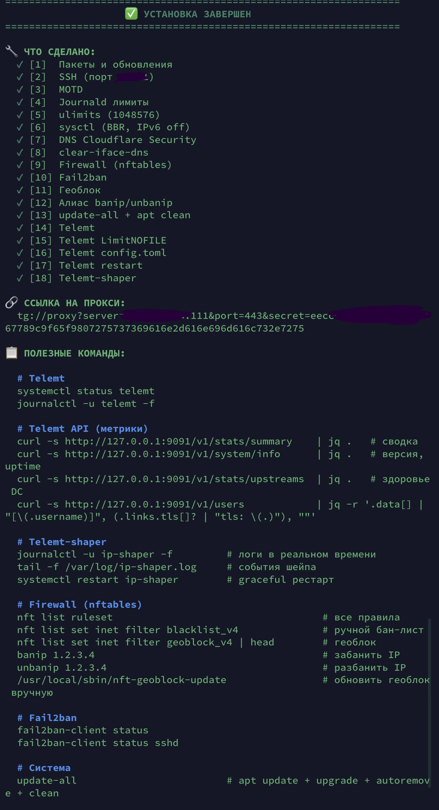

# telemt-node-installer

Интерактивный установщик ноды [Telemt](https://github.com/telemt/telemt) — Telegram-прокси на MTProto. Одним скриптом разворачивается всё: оптимизация ядра, firewall на nftables, геоблок, fail2ban, сам telemt и опционально [telemt-shaper](https://github.com/lie-must-die/telemt-shaper).

## Что делает

- Обновляет систему и ставит зависимости
- Тюнит SSH (кастомный порт, root+password auth, фикс сокета в Ubuntu 24.04)
- Ставит лимиты `nofile = 1048576` (глобально + drop-in для telemt)
- Включает BBR, настраивает TCP-буферы, отключает IPv6
- Переключает DNS на Cloudflare (`1.1.1.1 / 1.0.0.1`)
- Поднимает firewall на **nftables**: открыты только SSH и порт telemt
- Настраивает fail2ban с `nftables-multiport` backend
- Разворачивает геоблок стран через nftables sets + автообновление раз в неделю
- Добавляет команды `banip` / `unbanip` с персистентностью и сбросом conntrack
- Ставит telemt (тихая установка), заливает кастомный `telemt.toml`, перезапускает
- Опционально ставит `telemt-shaper`
- В конце — сводка, ссылка на прокси из API и шпаргалка по командам

Каждый блок опционален, дефолт — «да». Ничего не срабатывает без твоего подтверждения.

## Требования

- Ubuntu (рекомендуется чистая установка)
- Root или sudo
- Свободный порт для telemt (по умолчанию `443`)

## Установка

```bash
curl -fsSL https://raw.githubusercontent.com/lie-must-die/telemt-node-installer/main/setup-telemt-server.sh | sudo bash
```

## Что спрашивает

В начале скрипт предлагает прогнать [vps_check.sh](https://github.com/lie-must-die/MTPROTO/blob/main/vps_check.sh) — быстрый бенчмарк CPU / диска / сети. Затем флоу такой:

**1. Базовые параметры**
- SSH порт (дефолт `22`)
- Telemt порт (дефолт `443`)
- TLS-домен для маскировки (обязательный)

**2. Регистрация прокси в @MTProxyAdminBot**

Скрипт сразу генерирует secret (32 hex) и определяет внешний IP сервера, после чего выводит готовую инструкцию:

```
  1. Открой в Telegram: @MTProxyAdminBot
  2. Отправь команду: /newproxy
  3. Адрес прокси:    <внешний_IP>:<telemt_port>
  4. Secret:          <сгенерированный>
  5. Бот вернёт ad_tag (32-hex) — скопируй его для следующего шага
```

Сгенерированный secret тот же самый, что пойдёт в итоговый `telemt.toml`, — бот привязывает `ad_tag` именно к этой паре «адрес + secret», поэтому перегенерация после бота всё сломает. Скрипт этого не делает.

**3. `ad_tag`**
- `1)` Ввести полученный от бота (32 hex, валидируется)
- `2)` Пропустить (без ad_tag)

**4. 18 блоков установки** — Y/n на каждый (Enter = Да).

После этого всё идёт без интерактива.

<details>
<summary>📸 Пример работы</summary>

### Предварительный тест VPS




### Выбор опций




### Финальный вывод



</details>

## Полезные команды после установки

```bash
# Telemt
systemctl status telemt
journalctl -u telemt -f

# Telemt
journalctl -u telemt-shaper -f
tail -f /var/log/telemt-shaper.log
systemctl restart telemt-shaper

# Метрики и статистика через API
curl -s http://127.0.0.1:9091/v1/stats/summary    | jq .
curl -s http://127.0.0.1:9091/v1/system/info      | jq .
curl -s http://127.0.0.1:9091/v1/stats/upstreams  | jq .

# Ссылка на прокси
curl -s http://127.0.0.1:9091/v1/users | jq -r '.data[].links.tls[]?'

# Firewall
nft list ruleset
banip 1.2.3.4
unbanip 1.2.3.4
/usr/local/sbin/nft-geoblock-update   # обновить геоблок вручную

# Fail2ban
fail2ban-client status sshd

# Обновление системы
update-all
```

## Структура конфига telemt

Скрипт заливает `/etc/telemt/telemt.toml` с уже настроенными параметрами:

- TLS-режим (`secure = false`, `classic = false`)
- IPv6 отключён, STUN на Google/Cloudflare
- `listen_backlog = 65535`, `max_connections = 0` (без лимита)
- API на `127.0.0.1:9091` (whitelist `127.0.0.1/32`)
- Metrics на порту `9090`
- `conntrack_control` в режиме `notrack`
- Политика при неизвестном SNI — `reject_handshake`
- Пользователь `user1` с secret, сгенерированным на шаге регистрации прокси

Итоговая tg-ссылка (с актуальным доменом, портом и secret) выводится в конце установки — скрипт берёт её напрямую из API telemt.

## Важно

- При смене SSH-порта **не закрывай текущую сессию** пока не проверишь вход по новому порту.
- Пароль root не задаётся автоматически — после установки выполни `passwd root`, если это необходимо. 
- Геоблок на первом запуске скачивает ~30 CIDR-списков с `ipdeny.com`. При сбоях скрипт не роняет установку — просто пишет в `/var/log/nft-geoblock.log` и повторит через неделю по cron.
- Drop-in `/etc/systemd/system/telemt.service.d/limits.conf` перекрывает хардкод `LimitNOFILE=65536` из стокового юнита telemt. При обновлении telemt drop-in сохраняется.

## Лицензия

MIT. См. [LICENSE](LICENSE).
